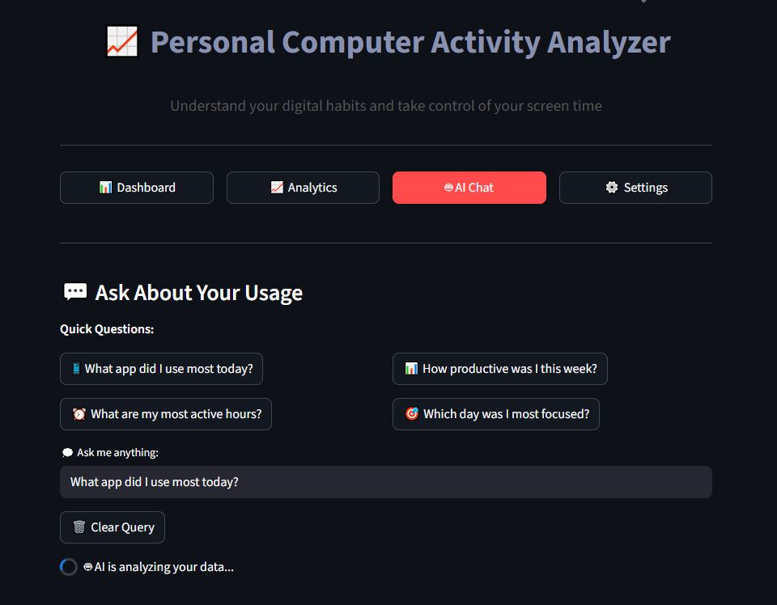
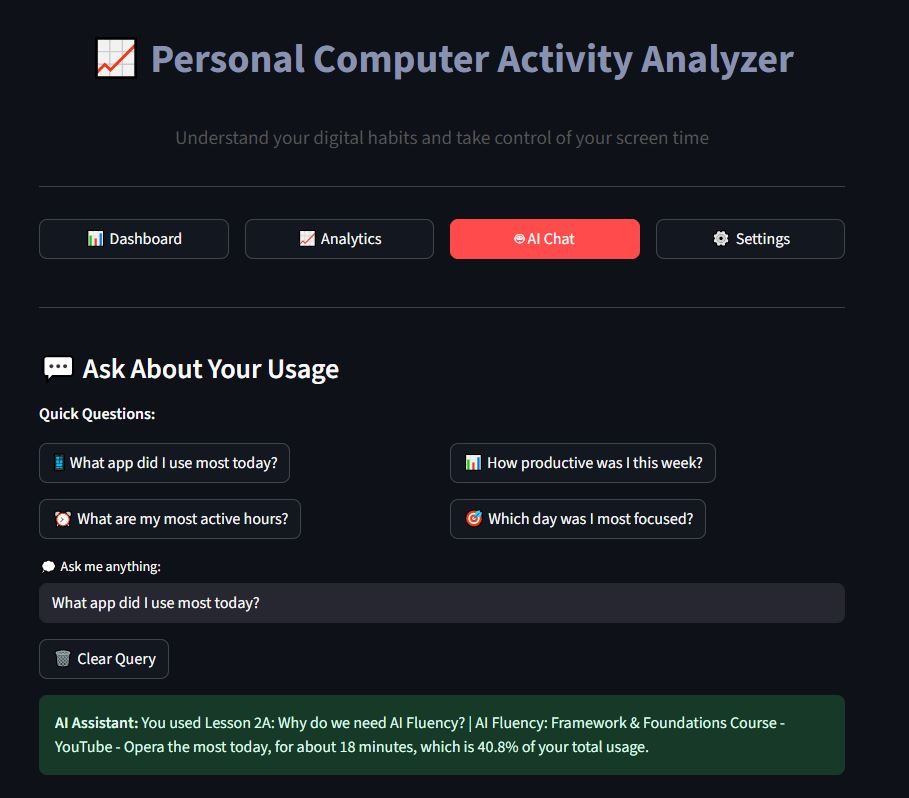
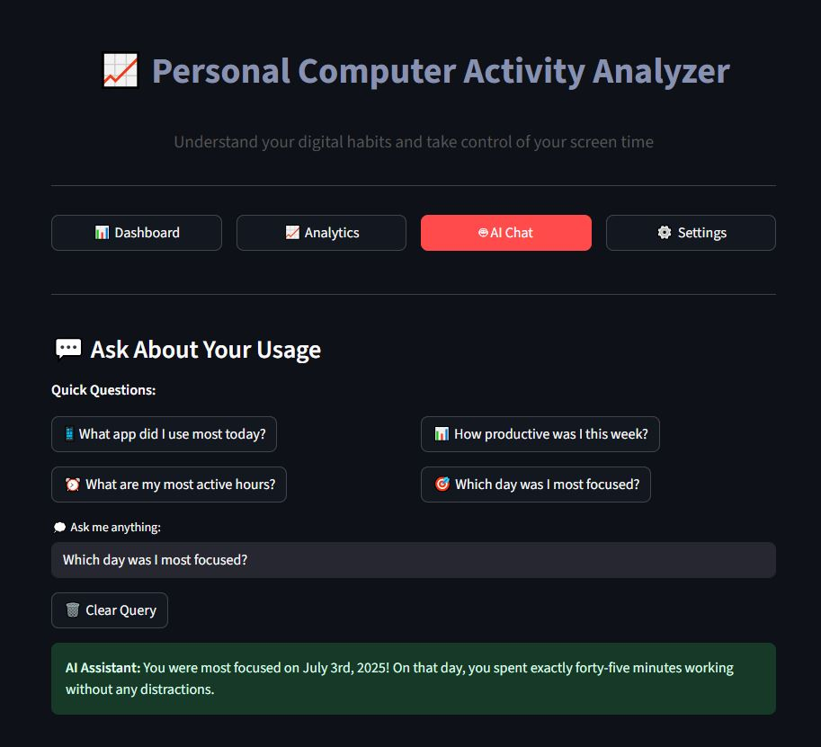
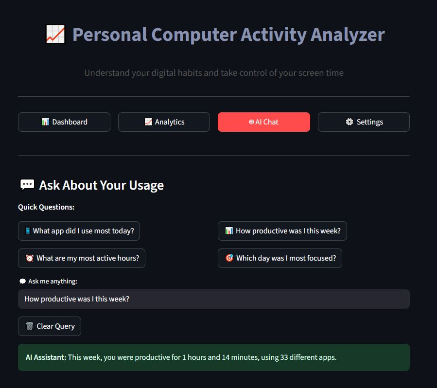
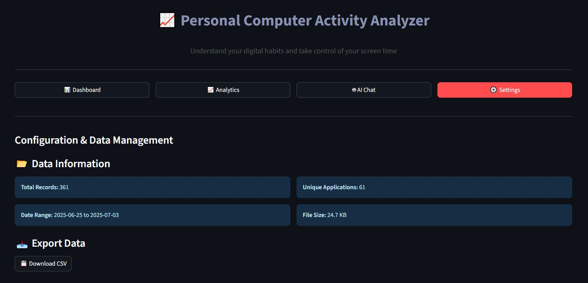
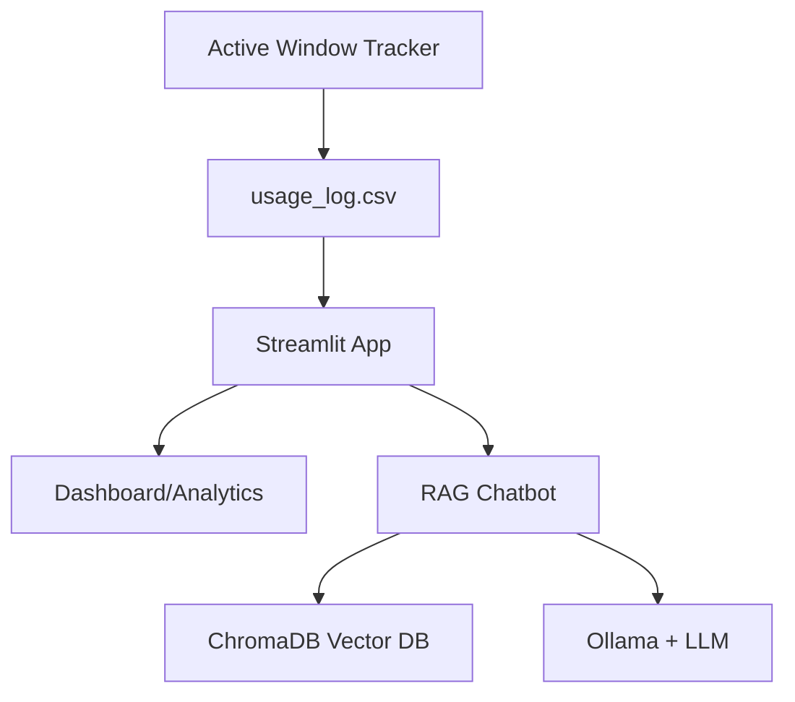

# PC Activity Analyzer

## 📌 Overview

**PC Activity Analyzer** is a privacy-first digital habit tracking tool that monitors your PC usage and provides AI-powered insights. All data processing and AI analysis happens locally on your device - no cloud uploads, no external API calls.

---

## ✨ Key Features

- **Real-time Activity Tracking** - Monitors active window usage on your PC
- **Interactive Dashboards** - Visualize your digital habits with charts and analytics
- **AI-Powered Insights** - Natural language chatbot answers questions about your usage patterns
- **Smart Filtering** - Filter data by app, date, time, and custom criteria
- **Privacy-First** - All data and AI processing stays on your device
- **Data Export** - Export your usage data as CSV for external analysis

### Dashboard & Analytics


*Detailed analytics with hourly, daily, and weekly breakdowns*

### Selected App – Avg. Session Duration & Analytics


### AI-Powered Chat






*Natural language chatbot for querying your usage patterns*

### Settings


---

## 🏗️ Architecture

### Core Components

- **Active Window Tracker:** Background service that logs app usage to CSV
- **Dashboard & Analytics:** Streamlit-based interactive UI for data visualization
- **RAG Chatbot:** AI assistant that answers questions using your own usage data
- **ChromaDB:** Local vector database for fast semantic search
- **Ollama + LLM:** Local large language model for generating AI responses

### Data Pipeline



### How It Works

1. **Data Collection** - Background tracker monitors active windows and logs usage to CSV
2. **Data Processing** - Raw data is cleaned and enriched with time-based features
3. **Embedding & Vectorization** - Usage summaries are converted to vector embeddings
4. **AI-Powered Insights** - RAG pipeline retrieves relevant data and generates natural language responses
5. **Interactive Visualization** - Streamlit UI presents dashboards and chatbot interface

---

## 🔧 Technical Stack

- **Python 3.11+** - Core programming language
- **Streamlit** - Web UI framework for dashboards
- **LangChain** - RAG pipeline orchestration
- **Ollama + LLaMA3** - Local large language model
- **ChromaDB** - Vector database for embeddings
- **Sentence Transformers** - Text embedding generation
- **pywin32 / win32gui** - Windows API for activity tracking
- **Plotly** - Interactive data visualizations
- **Pandas** - Data processing and analysis

---

## 📁 Project Structure

```
pc_activity_analyzer/
├── app.py                      # Main Streamlit application
├── active_windows_tracker.py   # Windows activity logging service
├── analyze_usage.py            # Standalone data analysis script
├── requirements.txt            # Python dependencies
├── README.md                   # Project documentation
├── styles.css                  # Custom Streamlit styles
├── data/
│   └── usage_log.csv           # Generated usage data
├── chroma_db/
│   └── chroma.sqlite3          # ChromaDB vector database
├── components/
│   ├── ai_chat.py              # AI chatbot UI component
│   ├── analytics.py            # Analytics dashboard component
│   ├── dashboard.py            # Main dashboard component
│   └── settings.py             # Settings and configuration UI
├── chatbot/
│   ├── data_loader.py          # Data loading utilities
│   ├── data_processing.py      # Data processing helpers
│   ├── document_processor.py   # Document creation for RAG
│   ├── embedding_store.py      # Embedding storage management
│   ├── llm_handler.py          # Ollama LLM integration
│   ├── quick_analysis.py       # Quick analytics processing
│   ├── quick_questions.py      # Predefined question patterns
│   ├── usage_data_rag.py       # RAG pipeline implementation
│   └── vector_store_manager.py # ChromaDB management
├── utils/
│   ├── data_loader.py          # General data loading utilities
│   ├── helpers.py              # Common helper functions
│   └── instance.py             # Singleton pattern helpers
└── images/                     # Screenshots and documentation assets
```


---

## 🛠️ Installation

### 1. Clone the Repository
```bash
git clone <repo-url>
cd pc-activity-analyzer
```

### 2. Install Python Dependencies
```bash
pip install -r requirements.txt
```

### 3. Install and Setup Ollama
Download and install Ollama from [ollama.com](https://ollama.com/), then:
```bash
ollama serve
ollama pull llama3
```

### 4. Generate Initial Data
Run the activity tracker to start collecting usage data:
```bash
python active_windows_tracker.py
```
Let it run for a while to collect some initial data, then stop it with `Ctrl+C`.

---

## ⚡ Quick Start

### 1. Start Ollama Service
```bash
ollama serve
```

### 2. Launch the Application
```bash
streamlit run app.py
```

### 3. Access the Dashboard
Open your browser and navigate to `http://localhost:8501`

### 4. Explore Features
- **Dashboard** - View your usage statistics and trends
- **Analytics** - Dive deeper into your digital habits
- **AI Chat** - Ask questions about your usage patterns
- **Settings** - Configure filters and export options

---

## ⚙️ Configuration

### Data Sources
- **Usage Log:** `data/usage_log.csv` (auto-generated by tracker)
- **Vector Database:** `chroma_db/` (created automatically)

### Customization Options
- **Ollama Model:** Default is `llama3` (configurable in code)
- **Tracking Interval:** Adjustable in `active_windows_tracker.py`
- **Data Retention:** Configure how long to keep historical data
- **UI Themes:** Custom styles in `styles.css`

---

## 🚀 Performance Features

- **Efficient Caching** - Embeddings and processed data are cached for fast access
- **Vector Search** - ChromaDB provides millisecond semantic search
- **Streamlit Optimization** - Smart caching reduces data processing overhead
- **Local Processing** - No network latency from cloud API calls

---

## 🔒 Privacy & Security

### Complete Data Privacy
- **Local Storage Only** - All data remains on your device
- **No Cloud Uploads** - Zero external data transmission
- **Local AI Processing** - LLM runs entirely on your hardware
- **Open Source** - Full transparency of data handling

### Data Control
- **Export Options** - Full control over your data export
- **Deletion Controls** - Easy data cleanup and removal
- **Access Logs** - Track what data is being accessed

---


## 📄 License

This project is licensed under the [MIT License](LICENSE) – see the LICENSE file for details.


---

## 🙏 Acknowledgments

> Inspired by the need for local, privacy-first digital habit analytics and AI-powered insights.
